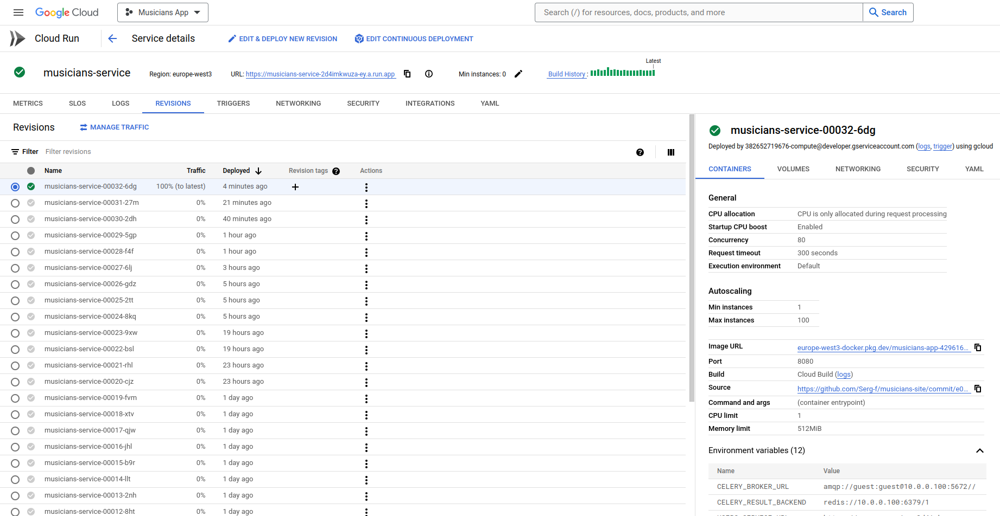

# Musicians Site

Welcome to the Musicians Site repository, a comprehensive web application designed with a microservices architecture, leveraging modern web development practices and technologies, and deployed on Google Cloud Platform.

## Key Features

- **Microservices Architecture**
  - **Frontend Service**: Built with React, featuring a responsive design.
  - **Users Service**: Backend service using Django Rest Framework (DRF), responsible for user data manipulation and authentication.
  - **Musicians Service**: Backend service using DRF, responsible for article data manipulation.

- **Auxiliary Services**
  - **Redis**: Used for caching.
  - **Celery and RabbitMQ**: Used for triggered and postponed tasks.

- **Database Management**
  - Backend services use independent remote PostgreSQL databases.
  - The musicians-service database stores no tokens or user information, except for user IDs in the articles table.
  - Secure communication between services ensures proper authorization and data manipulation.

- **Authentication and Authorization**
  - JWT tokens are used for secure authentication and authorization.

- **User Features**
  - Users can create, read, update, and delete articles about musicians.
  - Enhanced filtering and search capabilities using `django_filters` and other tools.
  - Users can filter articles by style (multiple choices), author, order them by different parameters, and use a search bar. These filters can be applied simultaneously.

- **Permission Management**
  - Strict permission rules are implemented:
    - Admins can read and delete any articles, including unpublished ones.
    - Common users can manage (read, update, publish, delete) their own articles.

- **User Accounts**
  - Each user has a personal account displaying general info and statistics about total and published articles.
  - Automated statistic updates triggered by article creation, updates, or deletions, ensuring accuracy. Celery and RabbitMQ handle these tasks after each article changing. Additionally all users' statistic synchronization scheduled to run nightly.

- **Caching**
  - Redis is used for caching to improve performance.

- **Testing**
  - Unit tests with mocking are implemented for backend services.

- **Environment Management**
  - Environment variables and secrets management:
    - Stored in `.env` file for local development.
    - Managed via GitHub secrets for repository storage.
    - Managed via Google Cloud Secrets Manager in production.

- **Logging**
  - Logging with different levels controlled by `LOG_LEVEL` environment variable.

- **Continuous Integration and Deployment**
  - CI/CD implemented using GitHub Actions.
  - Main services deployed on GCP using Cloud Run, with continuous deployment. Auxiliary services and PostgreSQL databases are hosted on separate Compute Engine VMs.

- **API Documentation**
  - Interactive live OpenAPI 3.0 specifications for backend services:
    - [Users Service](https://users-service-2d4imkwuza-ey.a.run.app/schema/swagger-ui/)
    - [Musicians Service](https://musicians-service-2d4imkwuza-ey.a.run.app/schema/swagger-ui/)

- **Development Setup**
  - `docker-compose.yml` is configured for development:
    - DRF services run with `python manage.py runserver` for debugging.
  - In production, services run with Gunicorn.

## Technologies Used

- **Frontend**: HTML, CSS, React, and libraries like Axios, React-Bootstrap, React-Router-Dom, React-Scripts, React-Toastify.
- **Backend**: Django, DRF, REST API, Django libraries (django-filter, django-environ, django-autoslug, django-embed-video, drf-spectacular, django-redis), Celery, RabbitMQ, PostgreSQL.
- **DevOps**: Docker, Docker Compose, CI/CD, GitHub Actions, GCP.
- **Google APIs & Services**:
  - Compute Engine API, Cloud Logging API, Cloud Run Admin API, Serverless VPC Access API, Secret Manager API, Container Analysis API, Cloud Pub/Sub API, IAM API, IAM Service Account Credentials API, Cloud DNS API.

## How It Works

### Microservices Interaction
- **Frontend Service**: Manages the user interface and communicates with backend services via REST APIs.
- **Users Service**: Handles user data and authentication.
- **Musicians Service**: Manages articles, checks permission, ensuring secure data manipulation by interacting with the Users Service for authorization.

### Data Flow
- **User Actions**: When users perform actions (create, update, delete articles), events are triggered.
- **Task Management**: Celery tasks handle asynchronous operations such as statistics updates.
- **Caching**: Redis improves performance by caching frequently accessed data.
- **Security**: JWT tokens and HTTPs ensure secure communication between services.

## Contributing

Anyone interested in contributing to the project is welcome.

## License

This project is licensed under the MIT License.

## Live Application

Check out the live application here: [Musicians App](https://frontend-service-build-2d4imkwuza-ey.a.run.app/)

The old monolith version of this project is available [here](https://musicians-app.me/).

