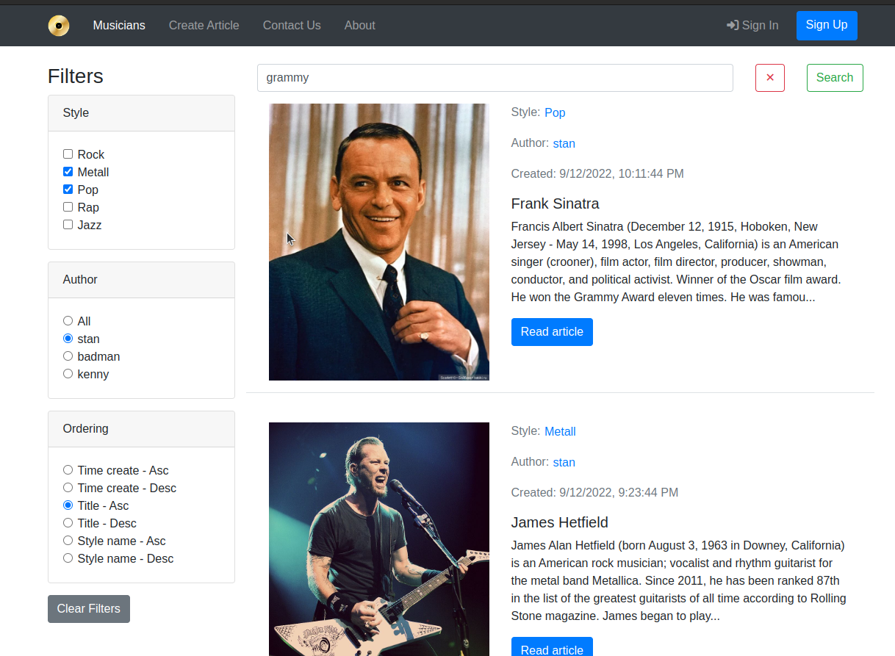

# Musicians Site

Welcome to the Musicians Site repository, a web application designed with a **clean microservices architecture**, leveraging modern web development practices and technologies, and deployed on Google Cloud Platform.

## Key Features

- **Clean Microservices Architecture**
  - The system is structured into distinct layers: 
    - **Frontend**: A React-based interface that interacts with the API gateway.
    - **API Gateway**: Managed by Kong, handling routing, authentication, and security.
    - **Infrastructure**: Includes Redis for caching, RabbitMQ as a message broker for communication between services, and PostgreSQL databases for persistent storage.
    - **Services**: 
      - **Users-Service**: Manages user data and authentication processes.
      - **Musicians-Service**: Handles core business logic related to articles.
  - Each service has its own database, ensuring loose coupling and independent scalability. The services communicate asynchronously via RabbitMQ, making the system highly decoupled and resilient.

- **Authentication**
  - Authentication is handled by the **Users-Service**, which issues **JWT tokens** signed using the RS256 signature algorithm. 
  - The **Kong API Gateway** is responsible for validating the JWT tokens using the RS256 public key.
  - If the token is valid, Kong injects the `user_id` into the `X-User-ID` header of requests to other services.
  - The **Musicians-Service** (and any additional services) operates directly with the `user_id` from the header, without knowledge of the authentication process itself. This decoupling ensures that the authentication mechanism can be changed or updated independently without affecting other services. It also allows the seamless addition of new services without needing to implement or manage authentication.

- **User Statistics**
  - A user statistics feature is implemented, which automatically recalculates user metrics (such as the number of published or total articles) whenever a user creates or deletes an article. This is managed via asynchronous messages through RabbitMQ, ensuring real-time updates while maintaining system performance.

- **Google Cloud Storage**
  - **Google Cloud Storage (GCS)** is connected to directly serve user-uploaded media files, ensuring scalable and efficient storage for user-generated content.

- **User Features**
  - Users can perform CRUD operations on their articles, with robust filtering and search capabilities using `django_filters`.
  - Permission management ensures that:
    - Admins can view and delete any article.
    - Users can manage their own articles.
    - Unpublished articles are only visible to their authors and admins.

- **Caching and Message Brokering**
  - **Redis** is used for caching frequently accessed data, improving overall performance.
  - **RabbitMQ** is the message broker for handling asynchronous tasks and communication between services.

- **Testing and Environment Management**
  - Comprehensive unit testing is implemented for backend services.
  - Environment variables are managed via `.env` files for development and through Google Cloud Secrets Manager in production.

## Technologies Used

- **Frontend**: React, Axios, React-Bootstrap, React-Router-Dom.
- **Backend**: Django, Django Rest Framework (DRF), PostgreSQL, Redis, RabbitMQ, Google Cloud Storage.
- **DevOps**: Docker, Docker Compose, Kong, Google Cloud Platform, CI/CD with GitHub Actions.
- **Other**: JWT (RS256), OpenAPI (Swagger), RabbitMQ, Kong.

## Contributing

Contributions from the community are welcome.

## License

This project is licensed under the MIT License.

## Live Application

Check out the live application here: [Musicians App](https://frontend-service-build-2d4imkwuza-ey.a.run.app/)

